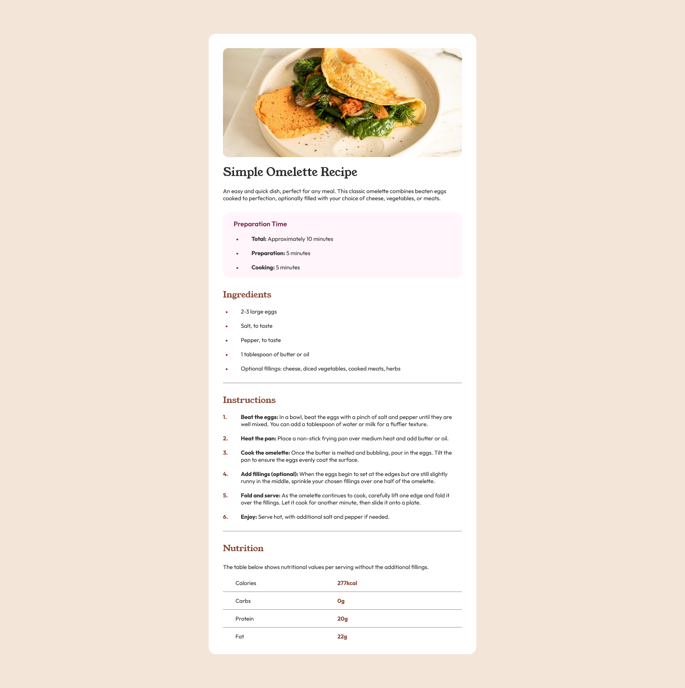

# Frontend Mentor - Recipe page solution

This is a solution to the [Recipe page challenge on Frontend Mentor](https://www.frontendmentor.io/challenges/recipe-page-KiTsR8QQKm). Frontend Mentor challenges help you improve your coding skills by building realistic projects. 

## Table of contents

- [Overview](#overview)
  - [Screenshot](#screenshot)
  - [Links](#links)
- [My process](#my-process)
  - [Built with](#built-with)
  - [What I learned](#what-i-learned)
- [Author](#author)

## Overview

### Screenshot

### Links

- Solution URL: [Add solution URL here](https://github.com/cristianmdn/simple-recipe)
- Live Site URL: [Add live site URL here](https://your-live-site-url.com)

## My process

### Built with

- CSS custom properties
- Flexbox
- CSS Grid
- Desktop-first workflow

### What I learned

This was a great experience. I learned how to:
- Link google fonts.
- Use incos.
- Write reusable code for CSS.
- How to use Media Queries.
- How to structure the HTML page and make it simple, and adding a few comments when necessary to make it more readable.
- How to read the CSS docs when I needed help to fix something before looking for a video tutorial.

I'm sure there are things that I didn't do right or that can be done better but for now, this is the best I can do for this project.
I will look for better solutions and continue to learn from them after I submit my project and share it to the community. Big thanks to the Frontend Mentor and Kyle from "Web Deb Simplified". You guys make incredible content.

## Author

- Frontend Mentor - [@cristianmdn](https://www.frontendmentor.io/profile/cristianmdn)
